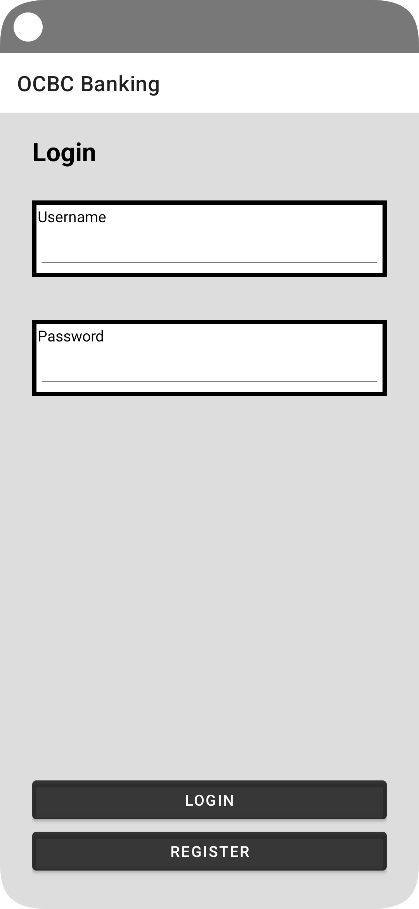
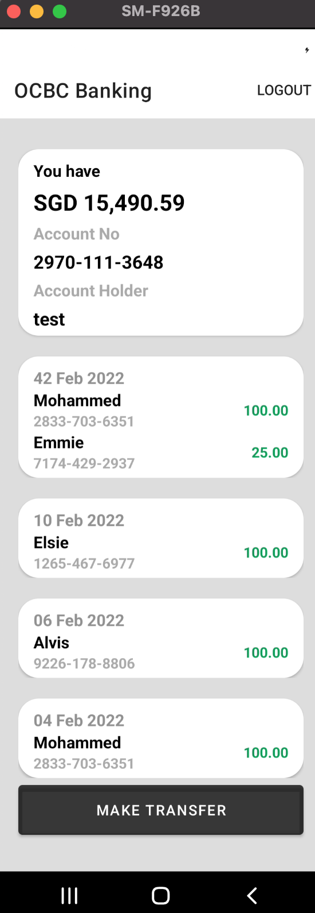
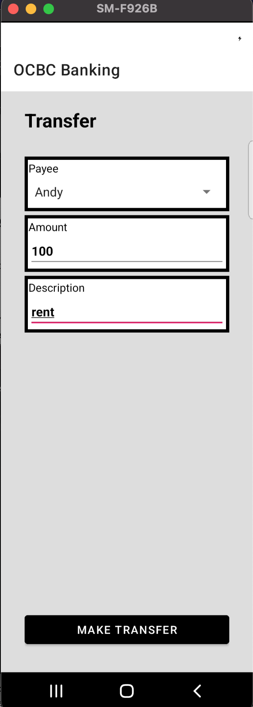

#@Author : [Mohammed Khalid Hamid]

*The project is in Kotlin
*Uses MVVM + Clean code Architecture
*Uses Co-routines for network calls
*Uses LiveData for UI update
* Built on Android Studio Dolphin | 2021.3.1 Canary 5
* Android SDK 32
* Gradle 7.4-all
* Android Gradle Plugin 7.3.0-alpha07


### Functionality
App shows has coding assignment for OCBC 
Has below features
1. Login
2. Register user
3. Show balance
4. Show transactions
5. Make transfer
6. Logout

This has Clean code architecture and has below layers
1. Repository layer: provides mock and remote interfaces
2. ViewModel Layer: business layer
3. View Layer: Android View layer


#### Building
##[The project uses Gradle KTS script]
## The project is in Kotlin

Run below command to build and install
`./gradlew app:installProdDebug`

## Quality
1. This project is formatted with Spotless can be added in commit/push hooks
   to maintain clean code review process
2. Has Lint baseline static check which can be added in CICD
3. Has Jacoco for code coverage config which can be added in CICD
4. Has checkstyle config static check which can be added in CICD

## APK can be found in [release]
## Screenshots can be found in  [release]

# Demo Finish







## Jacoco
run "jacocoPRODDEBUGReport"

## Security
Once gradle plugin applied, run following gradle task to check dependencies:

```
gradle dependencyCheckAnalyze --info
```

The reports will be generated automatically under `build/reports` directory.

If your project includes multiple sub-projects, the report will be generated for each sub-project in their own `build/reports`.


### Libraries
* [Android Support Library][support-lib]
* [Android Architecture Components][arch]
* [Android Data Binding][data-binding]
* [Dagger 2][dagger2] for dependency injection
* [Retrofit][retrofit] for REST api communication
* [Glide][glide] for image loading
* [Timber][timber] for logging
* [espresso][espresso] for UI tests
* [mockito][mockito] for mocking in tests
* [Dependency Security Chek][dependencyCheck] To run OSS scan on third party libraries and generate report

## Refernces

* https://github.com/firebase/FirebaseUI-Android


