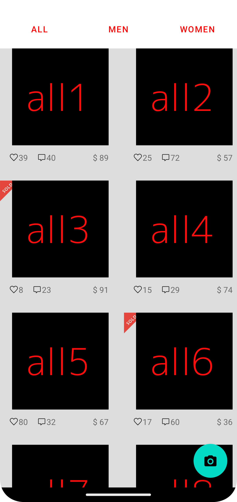

#@Author : [Mohammed Khalid Hamid]

*The project is in Kotlin
*Uses MVVM + Clean code Architecture
*Uses Co-routines for network calls
*Uses LiveData for UI update
* Built on Android Studio Hedgehog | 2023.1.1 Canary 15
* Android SDK 33
* Gradle gradle-8.0-bin
* Android Gradle Plugin 7.4.1


### Functionality
This app is code challenge for Mercari
It has below Features
1. Upon App launch app will fetch product categories and products in categories
2. Fetched data is saved Room database
3. In Main Page (TimelineFragment) Tabbed view pager shows all products per category from database
4. If Syncing is not completed in main page loading bar is shown until it is completed
5. Then data is retrieved from DB (DB is single Source of truth)

This has Clean code architecture and has below layers
1. Repository layer: provides mock and remote interfaces
2. ViewModel Layer: business layer
3. View Layer: Android View layer


#### Building
##[The project uses Gradle KTS script]
## The project is in Kotlin

Run below command to build and install
`./gradlew app:installProdDebug`

## Quality
1. This project is formatted with Spotless can be added in commit/push hooks
   to maintain clean code review process
2. Has Lint baseline static check which can be added in CICD
3. Has Jacoco for code coverage config which can be added in CICD
4. Has checkstyle config static check which can be added in CICD

## APK can be found in [release]
## Screenshots can be found in  [release]

# Demo Finish


## Jacoco
run "jacocoTestReport"
```
./gradlew app:jacocoTestReport
```

## Security
Once gradle plugin applied, run following gradle task to check dependencies:

```
./gradlew app:dependencyCheckAnalyze --info
```

The reports will be generated automatically under `build/reports` directory.
If your project includes multiple sub-projects, the report will be generated for each sub-project in 
their own `build/reports`.

# Dependency update
Displays a report of the project dependencies that are
up-to-date, exceed the latest version found, have upgrades, or failed to be resolved. When a
dependency cannot be resolved the exception is logged at the info level. To refresh the cache
(i.e. fetch the new releases/versions of the dependencies), use flag --refresh-dependencies.

url: https://github.com/ben-manes/gradle-versions-plugin

run below command
```
./gradlew app:dependencyUpdates -Drevision=release
```


### Libraries
* [Android Support Library][support-lib]
* [Android Architecture Components][arch]
* [Android Data Binding][data-binding]
*[EPOXY] [https://github.com/airbnb/epoxy]
* [Dagger 2][dagger2] for dependency injection
* [Retrofit][retrofit] for REST api communication
* [Glide][glide] for image loading
* [Timber][timber] for logging
* [espresso][espresso] for UI tests
* [mockito][mockito] for mocking in tests
* [Dependency Security Check][dependencyCheck] Dependencies vulnerability check
* [Dependency Update][dependencyUpdates] To check if dependencies are up-to-date


